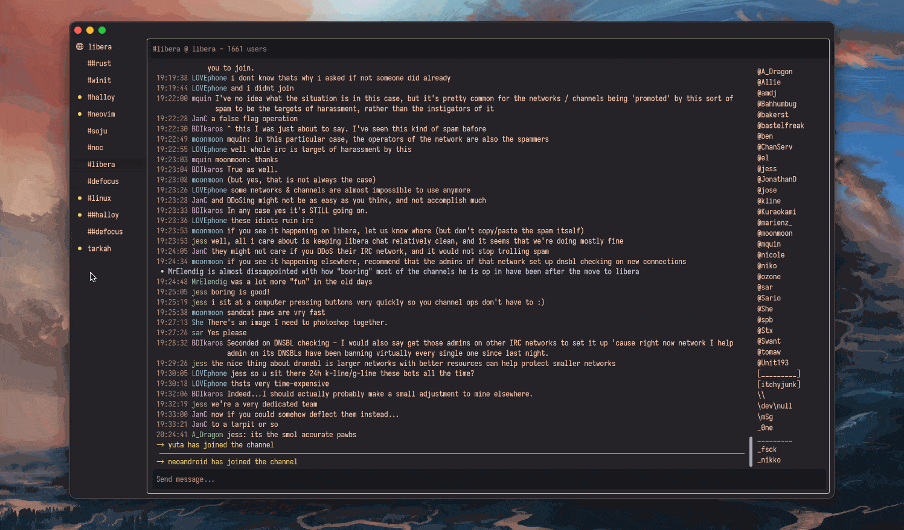

# Halloy - IRC Client

Halloy is an open-source IRC client written in Rust, with the Iced GUI library. It aims to provide a simple and fast client for Mac, Windows, and Linux platforms.

* Documentation for latest release: [https://halloy.chat](https://halloy.chat).
* Documentation for main branch (when building from source): [https://unstable.halloy.squidowl.org](https://unstable.halloy.squidowl.org).

Join **#halloy** on libera.chat if you have questions or looking for help.

## Installation

[Installation documentation](https://halloy.chat/installation.html)

Halloy is also available from [Flathub](https://flathub.org/apps/org.squidowl.halloy) and [Snap Store](https://snapcraft.io/halloy).

## Features

* IRCv3.2 capabilities
    * [account-notify](https://ircv3.net/specs/extensions/account-notify)
    * [away-notify](https://ircv3.net/specs/extensions/away-notify)
    * [batch](https://ircv3.net/specs/extensions/batch)
    * [cap-notify](https://ircv3.net/specs/extensions/capability-negotiation.html#cap-notify)
    * [chathistory](https://ircv3.net/specs/extensions/chathistory)
    * [chghost](https://ircv3.net/specs/extensions/chghost)
    * [echo-message](https://ircv3.net/specs/extensions/echo-message)
    * [extended-join](https://ircv3.net/specs/extensions/extended-join)
    * [invite-notify](https://ircv3.net/specs/extensions/invite-notify)
    * [labeled-response](https://ircv3.net/specs/extensions/labeled-response)
    * [message-tags](https://ircv3.net/specs/extensions/message-tags)
    * [Monitor](https://ircv3.net/specs/extensions/monitor)
    * [msgid](https://ircv3.net/specs/extensions/message-ids)
    * [multi-prefix](https://ircv3.net/specs/extensions/multi-prefix)
    * [read-marker](https://ircv3.net/specs/extensions/read-marker)
    * [sasl-3.1](https://ircv3.net/specs/extensions/sasl-3.1)
    * [server-time](https://ircv3.net/specs/extensions/server-time)
    * [setname](https://ircv3.net/specs/extensions/setname.html)
    * [Standard Replies](https://ircv3.net/specs/extensions/standard-replies)
    * [userhost-in-names](https://ircv3.net/specs/extensions/userhost-in-names)
    * [`UTF8ONLY`](https://ircv3.net/specs/extensions/utf8-only)
    * [`WHOX`](https://ircv3.net/specs/extensions/whox)
* SASL support
* DCC Send
* Keyboard shortcuts
* Auto-completion for nicknames, commands, and channels
* Notifications support
* Multiple channels at the same time across servers
* Commandbar for for quick actions
* Custom themes
* Portable mode

## Why?

## License

Halloy is released under the GPL-3.0 License. For more details, see the [LICENSE](LICENSE) file.

## Contact

For any questions, suggestions, or issues, please open an issue on the [GitHub repository](https://github.com/squidowl/halloy/issues).

