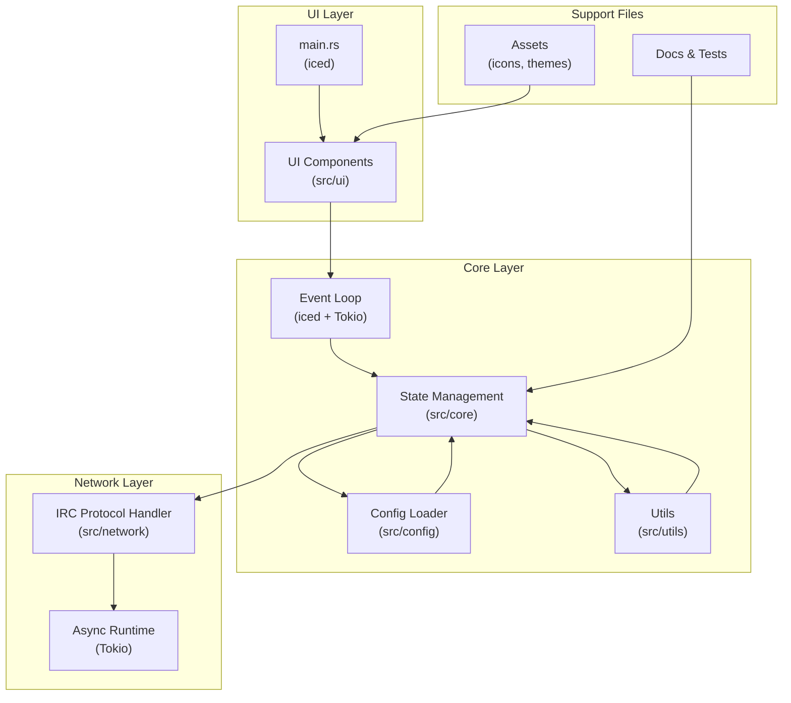

# Contributing

Halloy! If you don't know it yet, but "Halløj" is the a danish "Hello" or "Hi". Thank you for visiting our development guide.

You have various options for contributing to Halloy. Before you start working on Halloy, read the topics “[Be nice](#be-nice)”, "[Goals](#goals)" and "[Licensing](#licensing)"

- [Contributing](#contributing)
  - [Be nice](#be-nice)
  - [Goals](#goals)
  - [Licensing](#licensing)
  - [Contributing code](#contributing-code)
    - [Coding Prerequisites](#coding-prerequisites)
  - [Codebase Overview](#codebase-overview)
    - [Project Structure](#project-structure)
    - [Data Flow](#data-flow)
    - [Architecture](#architecture)
  - [Coding-Standards \& Guidelines](#coding-standards--guidelines)
    - [Formatting \& Linting](#formatting--linting)
  - [Submitting a Pull-Requests](#submitting-a-pull-requests)
    - [Rebase vs. Merge](#rebase-vs-merge)
    - [Open a PR](#open-a-pr)

## Be nice

**TBD:** Do we need such a policy? Do we want to adopt the [Rust CoC](https://www.rust-lang.org/policies/code-of-conduct)?

## Goals

- **simple:** The UI and functions should be intuitive and accessible.
- **fast:** *TBD*
- **eternal:** Halloy will be the last actively used software at the end of time.

## Licensing

Halloy is released under the **GNU General Public License v3.0 or later (GPL‑3.0‑or‑later)**, which means you’re free to use, modify, and distribute the code — but any derivative work must also carry the same copyleft terms.

By contributing code, you automatically license your contributions under GPL‑3.0‑or‑later. No Contributor License Agreement (CLA) needed — opening a pull request is enough.

Make sure any third‑party libraries or snippets you add are compatible with GPL‑3.0‑or‑later.

You’ll find the full license text in the [LICENSE](https://github.com/squidowl/halloy/blob/main/LICENSE) file, and it’s also declared in each Cargo.toml (license = "GPL-3.0-or-later").

## Contributing code

### Coding Prerequisites

Before diving into Halloy development, make sure you're comfortable with the following tools and technologies:

- **Rust:** The programming language Halloy is built with. If you're new to Rust, check out the [official learning resources](https://www.rust-lang.org/learn) to get started.​
- **iced:** A cross-platform GUI library for Rust that powers Halloy's user interface. Learn more at the [iced homepage](https://book.iced.rs).
- **Tokio:** An asynchronous runtime for Rust, essential for handling concurrent operations in Halloy. Visit the [Tokio project page](https://tokio.rs) for more information.​
- **Git:** distributed version control system that helps manage changes to the source code. If you're unfamiliar, the [Git book](https://git-scm.com/book/en/v2) is a great place to start.​
- **GitHub:** The platform we use for hosting the Halloy repository, tracking issues, and collaborating on code. You can find Halloy on [GitHub](https://github.com/squidowl/halloy).
- **IRC:** Halloy is an IRC client, so understanding the Internet Relay Chat protocol is beneficial. The [IRCv3 specifications](https://ircv3.net) provide comprehensive information about the protocol.

<!--
## Contributing documentation

### Documenting Prerequisites
-->

## Codebase Overview

Halloy is a modern IRC client built with Rust, leveraging the iced GUI library and the asynchronous capabilities of Tokio. The codebase is organized to promote clarity and ease of contribution.​

### Project Structure

Here's a high-level overview of the main directories and their purposes:​
Software Engineering Stack Exchange

- ```src/``` – Contains the main application code.
  - ```main.rs``` – Entry point of the application.
  - ```ui/``` – Modules related to the user interface built with iced.
  - ```etwork/``` – Handles IRC protocol communication and networking logic.
  - ```config/``` – Manages configuration files and settings.
  - ```utils/``` – Utility functions and helpers used across the application.
- ```assets/``` – Static files like icons and themes.
- ```docs/``` – Documentation files, including the user guide and developer notes.
- ```tests/``` – Integration and unit tests to ensure code reliability.​

Each module is designed to be as self-contained as possible, making it easier to navigate and understand specific parts of the application.​

### Data Flow

Halloy follows an event-driven architecture:​

User Input – User actions are captured through the UI components.
Event Handling – Inputs are translated into events that modify the application state.
State Update – The application state is updated accordingly.
UI Rendering – The UI reacts to state changes and re-renders components as needed.​
This unidirectional data flow ensures predictable behavior and simplifies debugging.​

### Architecture



## Coding-Standards & Guidelines

To keep things tidy, readable, and high-quality across Halloy — from source code to docs and config files — we follow a few simple rules. Sticking to these makes collaboration smoother, helps avoid unnecessary diffs, and ensures that contributions fit in nicely with the rest of the project.

If you're thinking about opening a PR, take a minute to go through the standards below. It’ll save everyone time — including you.

### Formatting & Linting

#### Rust

We use [rustfmt](https://github.com/rust-lang/rustfmt) to keep the Rust codebase clean and consistently formatted. Our config slightly deviates from the default — check out the [rustfmt.toml](https://github.com/squidowl/halloy/blob/main/rustfmt.toml) in the Halloy repo for the current setup.

Before committing, make sure to run:

```sh
cargo +nightly fmt --all
```

#### Markdown

Our documentations are written in [markdown](https://rust-lang.github.io/mdBook/format/markdown.html) and built using [mdBook](https://github.com/rust-lang/mdBook). We use a couple of extra pre-processors to improve the output:

- **[mdbook-external-links](https://github.com/jonahgoldwastaken/mdbook-external-links):** Makes external links open in a new tab.
- **[mdbook-linkcheck](https://github.com/Michael-F-Bryan/mdbook-linkcheck):** Verifies that internal links aren’t broken.
- **[mdbook-mermaid](https://github.com/badboy/mdbook-mermaid)** Adding mermaid.js support to draw fancy diagrams.

You can install both with:

```sh
cargo install mdbook-linkcheck mdbook-external-links
```

#### Other

If your editor supports [EditorConfig](https://editorconfig.org), it will automatically pick up the formatting rules from the [.editorconfig](https://github.com/squidowl/halloy/blob/main/.editorconfig) file in the repo. To double-check everything before committing, you can run [editorconfig-checker](https://github.com/editorconfig-checker/editorconfig-checker):

```sh
cargo install editorconfig-checker
editorconfig-checker
```

## Submitting a Pull-Requests

### Rebase vs. Merge

TODO

### Open a PR

TODO
