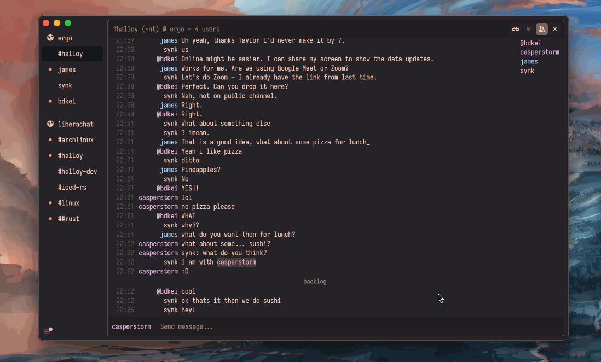

# Halloy

An open-source IRC client for Mac, Windows, and Linux, focused on being simple and fast.

 

## Cross platform

Halloy is a native desktop IRC client built with Rust and the [iced](https://github.com/iced-rs/iced/) GUI library. We use a single codebase to build natively to both Linux, macOS and Windows. See [Installation guide](./installation.md) to get started.

## Free and open source

Halloy is free and open source. You can find the source code as well as report issues and feature requests on [GitHub](https://github.com/squidowl/halloy).

## Customization

Halloy is configured through a `config.toml` file. From servers and notifications to themes, fonts, panes, and keyboard shortcuts, there are many options available to tune Halloy to your liking. See [Configuration](./configuration.md) to get started.

## IRCv3 Capabilities

We strive to be a leading irc client with a rich ircv3 feature set. currently supported capabilities:

- [account-notify](https://ircv3.net/specs/extensions/account-notify)
- [away-notify](https://ircv3.net/specs/extensions/away-notify)
- [batch](https://ircv3.net/specs/extensions/batch)
- [cap-notify](https://ircv3.net/specs/extensions/capability-negotiation.html#cap-notify)
- [chathistory](https://ircv3.net/specs/extensions/chathistory)
- [chghost](https://ircv3.net/specs/extensions/chghost)
- [echo-message](https://ircv3.net/specs/extensions/echo-message)
- [extended-join](https://ircv3.net/specs/extensions/extended-join)
- [invite-notify](https://ircv3.net/specs/extensions/invite-notify)
- [labeled-response](https://ircv3.net/specs/extensions/labeled-response)
- [message-tags](https://ircv3.net/specs/extensions/message-tags)
- [Monitor](https://ircv3.net/specs/extensions/monitor)
- [msgid](https://ircv3.net/specs/extensions/message-ids)
- [multi-prefix](https://ircv3.net/specs/extensions/multi-prefix)
- [multiline](https://ircv3.net/specs/extensions/multiline)
- [react](https://ircv3.net/specs/client-tags/react.html)
- [read-marker](https://ircv3.net/specs/extensions/read-marker)
- [sasl-3.1](https://ircv3.net/specs/extensions/sasl-3.1)
- [server-time](https://ircv3.net/specs/extensions/server-time)
- [setname](https://ircv3.net/specs/extensions/setname.html)
- [Standard Replies](https://ircv3.net/specs/extensions/standard-replies)
- [typing](https://ircv3.net/specs/client-tags/typing)
- [userhost-in-names](https://ircv3.net/specs/extensions/userhost-in-names)
- [`UTF8ONLY`](https://ircv3.net/specs/extensions/utf8-only)
- [`WHOX`](https://ircv3.net/specs/extensions/whox)
- [`soju.im/bouncer-networks`](https://codeberg.org/emersion/soju/src/branch/master/doc/ext/bouncer-networks.md)
- [`draft/FILEHOST`](https://github.com/progval/ircv3-specifications/blob/filehost/extensions/filehost.md)
- [`soju.im/FILEHOST`](https://soju.im/filehost)
